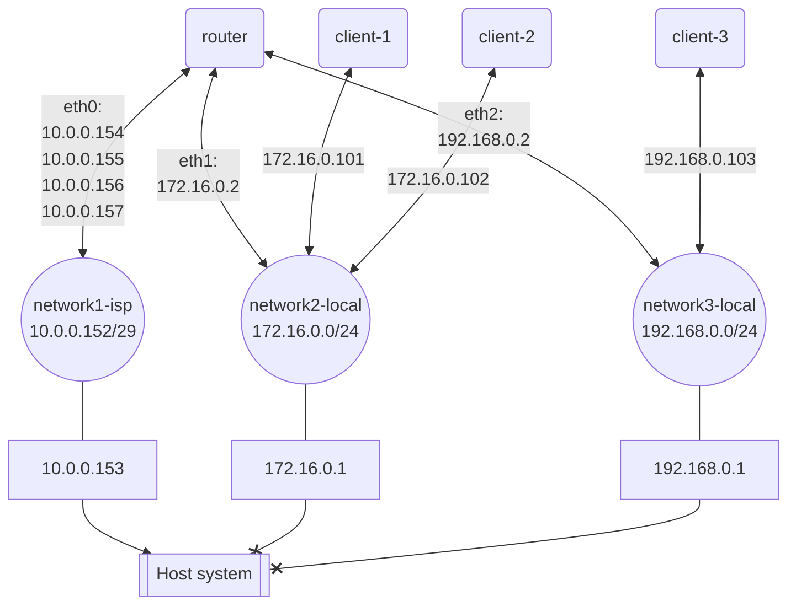

# Network Test Environment

This is Docker environment for testing configuration of network tools like
[iptables](https://linux.die.net/man/8/iptables/).

## Run

Start test environment:

```sh
$ docker compose up -d
```

Every host have port `8080` that return it's hostname:

```sh
$ docker exec -it router bash
$ curl localhost:8080
Current hostname is 'router'
$ curl 10.0.0.154:8080
Current hostname is 'router'
$ curl 172.16.0.2:8080
Current hostname is 'router'
$ curl 192.168.0.2:8080
Current hostname is 'router'
$ curl 172.16.0.101:8080
Current hostname is 'client-1'
$ curl 172.16.0.102:8080
Current hostname is 'client-2'
$ curl 192.168.0.103:8080
Current hostname is 'client-3'
$ exit
```

## Network scheme



## Links

-   [Use docker container as network gateway - Stack Overflow](https://stackoverflow.com/a/69055795/1095712)
-   [iptables(8) - Linux man page](https://linux.die.net/man/8/iptables/)

## Licenser

Distributed under MIT license.
